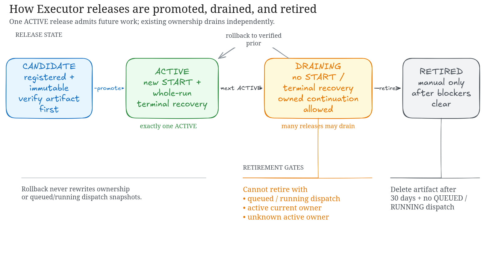
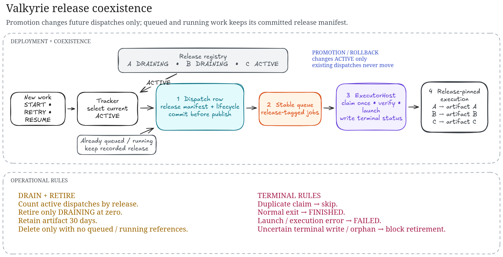
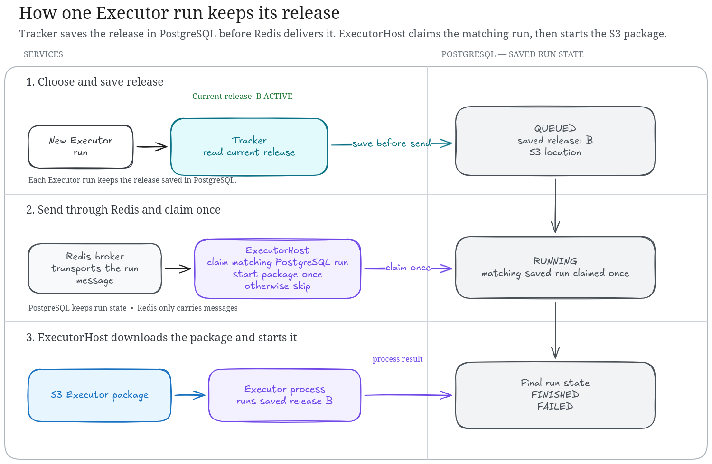

# Executor releases

Valkyrie keeps executor releases immutable. PostgreSQL owns the admission pointer,
each benchmark stores its initial release identity, and each executor dispatch
stores the release and artifact selected for that invocation.

## Lifecycle

1. Register a candidate with an `s3://` artifact, a SHA-256 digest, and protocol
   version `1`.
2. Verify readiness, then promote it. New benchmarks and whole-run terminal
   recovery select the `ACTIVE` release.
3. Benchmark admission stores immutable initial ownership and mutable current
   execution ownership before Tracker creates the immutable queued dispatch.
   ExecutorHost atomically claims that dispatch before launching the subprocess
   and marks it terminal after the subprocess exits.
4. The previous active release becomes `DRAINING`. It receives no new benchmark
   starts or terminal restarts, but active executions that it owns continue using
   it.
5. Whole-run terminal recovery moves current execution ownership to the then-
   `ACTIVE` release. In-progress retry never changes that ownership.
6. Retirement remains blocked by queued or running dispatches, active current
   owners, or any active benchmark whose current owner is unknown.
7. Roll back an executor release by promoting a verified previous release.
   Existing execution ownership and immutable dispatch snapshots are not
   rewritten.



## Execution-pinned recovery

Release routing changes only when an execution crosses a whole-run terminal
boundary. It does not change which tasks retry or resume selects.



| Operation and benchmark state | Executor release |
| --- | --- |
| New benchmark start | The `ACTIVE` release |
| Original work while `IN_PROGRESS` | The benchmark's current execution release |
| Retry dispatch while `IN_PROGRESS` | The current execution release, including when it is `DRAINING` |
| Resume while `IN_PROGRESS` | Existing behavior is unchanged; it does not hand off release ownership |
| Partial task stop while the benchmark remains `IN_PROGRESS` | No handoff; the benchmark keeps its current execution release |
| Retry or resume while `STOPPING` | Rejected, as today |
| Retry or resume from `STOPPED`, `FINISHED`, or `ERROR` | The `ACTIVE` release, which becomes the benchmark's current execution release |

A benchmark keeps two distinct ownership facts:

- **Initial release:** immutable provenance for the benchmark's first admission.
- **Current execution release:** the release used by continuation retries while
  the benchmark is active. A whole-run terminal retry or resume replaces this
  pointer with the then-`ACTIVE` release.

Every executor dispatch keeps its own immutable release and artifact snapshot.
A release becoming `DRAINING` never rewrites queued or running dispatches.



Benchmark ownership commit is the start-admission boundary. That admission
transaction sets both immutable initial ownership and current execution
ownership to the locked `ACTIVE` release. If A becomes `DRAINING` after that
commit but before its `START` dispatch is created, the already-admitted benchmark
remains on A. Its benchmark ownership blocks A from retirement until the
dispatch ledger represents it or the benchmark becomes terminal. Benchmark and
`START` dispatch persistence are deliberately not made atomic by this
recovery-affinity change.

### Deployment during an active run

Given release A running a benchmark at 40/100 when B is promoted:

1. The 40 running tasks remain on A.
2. Tasks 41-100 from the existing execution also remain on A.
3. A mid-run retry remains on A.
4. A new benchmark start uses B.
5. Promotion alone never migrates tasks from A to B.

### Whole-run stop and recovery

For a graceful whole-run stop, tasks already running finish on the current
execution release. Tasks selected by the existing stop behavior become stopped.
After the benchmark reaches `STOPPED`, the existing resume behavior runs its
selected work on the `ACTIVE` release and establishes that release as the new
current execution release.

For a forced whole-run stop, interrupted tasks follow the existing stop and
resume selection behavior. After the benchmark reaches `STOPPED`, resumed work
uses the `ACTIVE` release.

For example, after A reaches a whole-run terminal state and recovery starts on
B, later mid-run retries stay on B even if C has been promoted. A later
whole-run terminal retry or resume may then establish C as the current execution
release.

### Draining and retirement

A `DRAINING` release accepts no new benchmark starts or terminal restarts. It may
accept continuation retries for an `IN_PROGRESS` benchmark whose current
execution release is already that release.

Retirement remains blocked while a release owns an active execution or has a
queued or running dispatch. Once the execution and its dispatches are terminal,
a later retry or resume uses the `ACTIVE` release instead of retaining the old
release.

If the required current execution release or an `ACTIVE` release is unavailable,
recovery fails explicitly. It never silently switches releases.

### Non-goals

This release-affinity change does not alter:

- task selection for retry, resume, graceful stop, or forced stop;
- scoring, result history, or run IDs;
- partial-task stop behavior;
- concurrency limits or sandbox queue scheduling;
- task-level release assignment or automatic migration during promotion.

### Benchmark release provenance

Benchmark responses expose these release fields:

| Field | Meaning |
| --- | --- |
| `executor_release_id` | Immutable release selected when the benchmark was first admitted. |
| `current_execution_release_id` | Release currently owning execution. It changes only after a whole-run terminal retry or resume. |
| `executor_artifact_digest` | Immutable digest of the initial release artifact; it may differ from the artifact used after a terminal handoff. |
| `executor_protocol_version` | Immutable protocol version of the initial release. |

Pre-migration benchmarks can return null for these fields. The metadata endpoint
also exposes the initial `executor_artifact_uri`. The immutable per-dispatch
snapshot is authoritative for the exact artifact used by each invocation.

An `IN_PROGRESS` benchmark without a current execution release cannot continue.
Any `IN_PROGRESS` or `STOPPING` benchmark without one blocks all release
retirement. After it becomes terminal, retry or resume may establish the
`ACTIVE` release as its current owner.

### Operator visibility

Global release health is available only through the trusted direct-database
`tracker.release_cli status` command. It is not exposed through tenant HTTP.
The JSON report includes the active admission pointer, readiness and retention
metadata, active execution counts, exact dispatch/current-owner blockers, and
unattributed active executions.

A current-owner benchmark record is omitted as a duplicate only when a queued or
running dispatch exists for the same benchmark on the same current release. An
active dispatch on another release never suppresses that owner record. The
unattributed count includes every `IN_PROGRESS` or `STOPPING` benchmark with
null current ownership, regardless of dispatch history.

### Failure and rollback policy

An invalid or missing persisted owner for in-progress recovery is a `409`
conflict. Terminal recovery without a valid `ACTIVE` release is a `503` service
availability failure. A post-commit enqueue acknowledgement failure is also a
`503`; Tracker leaves the immutable dispatch `QUEUED` and returns/logs its ID for
operator investigation.

Executor rollback means promoting a verified previous executor release and
allowing existing executions to drain on their current owners. It does not roll
back Tracker or PostgreSQL.

Migration `e9f0a1b2c3d4` is forward-only because dropping current ownership would
destroy required execution state. Normal rollback must never run `alembic
downgrade` across it. After this migration is applied, do not deploy a pre-
Package-R Tracker image: its migration history cannot resolve `e9f0a1b2c3d4` and
its runtime does not maintain current ownership. Fix Tracker failures forward;
database restoration is a separately approved disaster-recovery operation.

## Operator commands

Run these commands from the Tracker environment with its database settings and
AWS credentials:

```bash
uv run python -m tracker.release_cli status
uv run python -m tracker.release_cli register RELEASE_ID s3://bucket/key SHA256_DIGEST
uv run python -m tracker.release_cli verify RELEASE_ID
uv run python -m tracker.release_cli promote RELEASE_ID
uv run python -m tracker.release_cli retire RELEASE_ID
```

`verify` streams the S3 object and checks its SHA-256 digest before promotion.
For initial activation, run `register` → `verify` → `promote` → `status` before
accepting benchmark traffic. Until `status` reports an `ACTIVE` admission target,
new benchmark starts return `503`.

## Artifact retention

Retirement records a 30-day `artifact_retention_until` window. Artifact removal
is allowed only when the release is `RETIRED`, the window has expired, the
release has no active current owner or queued/running dispatch, and no
unattributed active benchmark exists. The current code exposes the deletion
guard; it does not run an automatic cleanup job.

An uncertain dispatch fails closed. A broker acknowledgement loss or ExecutorHost
crash can leave a nonterminal dispatch that blocks retirement until an operator
investigates it. A producer error does not prove that Redis rejected the append;
missing stream evidence does not prove non-delivery. Tracker returns and logs the
immutable dispatch ID for correlation.

Use this bounded investigation sequence:

1. Inspect the PostgreSQL dispatch row by immutable ID.
2. If it is `RUNNING` or terminal, do not replay it. A broker redelivery of that
   same ID cannot claim `RUNNING` again and the host skips executor side effects.
3. If it is `QUEUED`, inspect Redis stream/pending state and correlated logs only
   for evidence that append occurred. Absence is never proof of non-delivery.
4. Leave an unresolved row fail-closed. Replay or terminalization requires a
   separately approved and audited operator action that first resolves the
   execution outcome.

There is deliberately no scheduler, heartbeat, reaper, generic requeue path, or
automatic orphan repair in this release-safety layer.

Successive promotions are independent: A, B, and C may all drain concurrently,
and each retires when its own active execution count reaches zero. There is no
two-release limit.

Do not delete a release artifact manually while `tracker.release_cli status`
reports an active-execution or retention blocker.

## Release-test

The current release-test stage is dev-sized but runs in the production AWS
account. Every operation must specify `STAGE=release-test`, account
`613431292675`, and region `us-east-1`; unrelated account resources remain
outside the release-test boundary.

The Package R driver is a static Fargate task definition, not a service. It has a
no-ingress security group, explicit VPC/database/Redis/DNS/HTTPS egress, retained
logs, named secret references, and separate execution, task, and operator roles.
The operator role can run only that task definition and pass only its two roles.
Public IP assignment is a launch-time requirement because the stage has public
subnets and no NAT gateway; it does not expose Tracker, whose ALB remains
internal.

Before synthesis, set:

```bash
export RELEASE_TEST_DRIVER_SECRET_ARN=arn:aws:secretsmanager:us-east-1:613431292675:secret:valkyrie/release-test/package-r-driver-SUFFIX
export RELEASE_TEST_OPERATOR_PRINCIPAL_ARN=arn:aws:iam::613431292675:role/ROLE_NAME
export RELEASE_TEST_IMAGE_TAG=package-r-RUN_ID
```

The principal must be an IAM role ARN, not an STS assumed-role session ARN. The
secret reference must be its complete generated ARN, including the suffix; a
name or partial ARN is not valid for ECS injection. The secret must contain
exactly `tracker_api_key` and
`benchmark_authorization`; ECS injects those values and the database credentials
from Secrets Manager. Never put secret values in task command or environment
overrides.

Release-test owns immutable `valkyrie/release-test/tracker` and
`valkyrie/release-test/executor-host` ECR repositories. This avoids mutating the
account-wide CDK bootstrap repository. Deploy Shared first when creating those
repositories, build and push both ARM64 images with the same new immutable tag,
then synthesize and deploy the dependent stacks with that tag. Dev and prod keep
the existing CDK asset path.

Review all stacks and the driver separately before deployment:

```bash
make plan STAGE=release-test SCOPE=all AWS_REGION=us-east-1 \
  DEV_ACCOUNT_ID=613431292675 PROFILE=admin
make plan STAGE=release-test SCOPE=driver AWS_REGION=us-east-1 \
  DEV_ACCOUNT_ID=613431292675 PROFILE=admin
```

The driver launch contract is published under
`/valkyrie/release-test/driver/`: task-definition ARN, security-group ID, log
group name, and operator-role ARN. Shared outputs already provide the cluster
and public subnet IDs. Launches must use those exact values,
`assignPublicIp=ENABLED`, and only reviewed non-secret command/manifest
overrides. The default command is the direct-database `release_cli status`
preflight.

The stage connects to `benchmarks.vals.ai`. Local clients outside the VPC cannot
call the internal Tracker directly; use the driver for HTTP and database proof.

For migration `e9f0a1b2c3d4`, first prove empty and populated paths in disposable
local PostgreSQL. In release-test, proceed only when the database is inactive
and its revision is exactly predecessor `d8e9f0a1b2c3` or already at head. Take
a named snapshot before a predecessor migration, deploy Tracker first, verify
schema/data/status, run the expected downgrade rejection, and only then deploy
Worker and Monitoring. Any other revision, active work, or ambiguous state
blocks deployment. Do not recreate or restore the database as part of this
path.

The legacy Worker and stable ExecutorHost consume separate queues. Legacy
messages remain on `taskiq` and never reach the ExecutorHost. Every message on
`valkyrie-stable` must include an executor dispatch ID and immutable artifact
identity; the host claims the matching PostgreSQL dispatch before downloading or
executing the artifact. The execution-affinity migration requires no
ExecutorHost compatibility branch or queue-drain sequencing.
