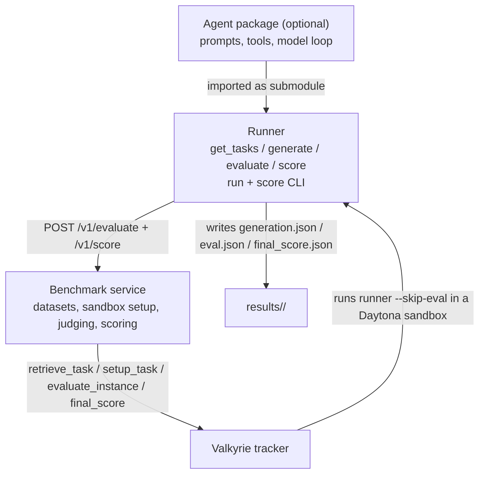

# Adding a New Benchmark to Valkyrie (End-to-End Guide)

> Practical companion to **Benchmark Runner & Eval API: Framework**. That doc defines the *contracts*; this one is the *step-by-step* an engineer follows to take a new benchmark from empty repo to a scored Valkyrie run.

> ⚠️ This guide is written toward the **target framework** (the two contracts + one package shape). Where a piece of that target is genuinely not built yet (artifact-rehydration / external-async `/v1/` payloads), you'll see a note saying so. Both framework layers are **shipped**: `create-benchmark-service` for the service and `create-benchmark-runner` for the runner. The canonical end-to-end example is **Legal Research** (service + runner both on-framework). `fabv2-runner` predates `create-benchmark-runner` and is hand-rolled — read it for the service contract, not as the runner template.

---

## 1. Mental model

A Vals benchmark is **three contracts and one package shape**, exactly as the framework doc defines them:

1. **The eval-API contract** — what the benchmark service exposes for scoring, in two phases: per-task evaluation and final aggregation.
2. **The runner contract** — the adapter (`load_tasks` + `generate`) plus the `run`/`score` CLI, supplied by the `create-benchmark-runner` framework.
3. **The package shape** — every new benchmark ships a **benchmark service** (required) and a **runner** (required); a separate **agent package** is optional.



### Two execution paths

The same packages serve two callers. What differs is the entry point and who runs evaluation.

| Path | Who invokes | Who runs eval |
|---|---|---|
| **Valkyrie-orchestrated** (internal / Vals-hosted) | Tracker launches `<benchmark> run --skip-eval …` inside a Daytona sandbox | Valkyrie reads `generation.json` from the sandbox and calls the service over WebSocket (`/ws/evaluate-instance`), then `calculate_final_score` |
| **Eval-API-only** (external lab) | Lab runs `<benchmark>-runner run …` in its own infra | The runner's framework-provided `evaluate()`/`score()` POST each task to `/v1/evaluate`, then `/v1/score` |

> 📌 Both paths call the **same** scoring code. `/v1/evaluate` and `/evaluate-response/` share a handler; `/v1/score` and `/final-score/` share a handler. You implement scoring **once** in the service and inherit both surfaces from `BenchmarkServiceApp`.

---

## 2. Decide before you build

### 2.1 Pick your eval shape first — it gates everything

The eval shape determines your `/v1/evaluate` payload, what happens server-side, and whether `setup_task`/`evaluate_instance` need a sandbox. Decide this before writing the service.

| Shape | Submission | Server-side | Example | Status |
|---|---|---|---|---|
| **Text-response** | `payload.type="text"`, data is the string answer | Grade directly, no sandbox | FAB v2, Legal Research | **Shipped** — start here |
| **Artifact rehydration** | `payload.type="artifact"` (diff, file, repo bundle, `result.json`) | Clean sandbox → apply artifact → existing evaluator → tear down | SWE-bench, CyberBench, proof-bench, IOI | Target — `/v1/` artifact payloads not built yet |
| **External async** | `payload.type="artifact"`, forwarded to an external evaluator | Forward, don't block; return `status: pending` + `poll_url` | VCB (Playwright UI tests) | Target — needs a per-benchmark design |

> 🚦 If your benchmark produces a text answer judged by an LLM or rubric, you are **text-response** — the only fully shipped shape end-to-end. Build that first even if you later add an artifact path.

### 2.2 Name your repos

Follow the conventions exactly — the registries and deploy tooling key off them:

- `<name>-benchmark-service` — required (submodule name in `benchmark-services-registry` must match this prefix).
- `<name>-runner` — required.
- `<name>-agent` — optional, submoduled into the runner.
- `<name>_agent` — the agent-registry directory (Valkyrie contract; underscores, not hyphens).

### 2.3 Gather inputs

- The dataset (tasks + rubric/checks/answers).
- Model + tool provider keys, mapped to AWS Secrets Manager secret names.
- Descope setup: all benchmark services authenticate with Descope, so you'll add a tenant/dataset entry to `allowlist.yaml` (Step 6).

---

## 3. Step 1 — Build the benchmark service

The service is **always required**. It owns datasets, task validation, sandbox setup for Valkyrie runs, evaluation, final scoring, result metadata/rollups, auth, and the dataset allowlist gate.

### 3.1 Scaffold

```bash
uv tool install git+ssh://git@github.com/vals-ai/create-benchmark-service.git@main
create-benchmark-service <name>
# -> ./<name>-benchmark-service/ with main.py, src/<pkg>/, tests/, Dockerfile,
#    Makefile, .github/workflows/, pyproject.toml
```

### 3.2 Implement the `BenchmarkService` subclass

Subclass `BenchmarkService` (from `benchmark_service.base`) and implement its abstract methods. The `create()` factory calls `load_datasets()` once and stores the result on `self.datasets`.

| Method | What you implement |
|---|---|
| `load_datasets()` | Load every task; return `dict[dataset_name, dict[task_id, task]]`. |
| `retrieve_task(task_id, skip_validation, dataset)` | Return a `RetrieveTaskResponse`: `docker_image`, `problem_path`, `cwd`, `agent_timeout`, and `Resources(vcpu, memory, disk)`. This is what Valkyrie uses to size and image the sandbox. |
| `setup_task(task_id, sandbox, dataset)` | Async generator. Write the task into the live Daytona sandbox (e.g. the question to `/tmp/problem_statement.txt`, or a one-task dataset wrapper to `/app/data/dataset.json`). Yield `StreamChunk`s. |
| `evaluate_response(request, dataset)` | **The core scoring fn** for text-response. Grade `request.response` against the task rubric; return your benchmark-specific result (e.g. `pass_percentage`, `check_results`). Powers `/v1/evaluate` **and** `/evaluate-response/`. |
| `evaluate_instance(task_id, sandbox, dataset)` | Async generator for the Valkyrie sandbox path. Download `generation.json` from the sandbox, judge, yield progress + a final `StreamResultChunk`. |
| `calculate_final_score(evaluation_results, dataset)` | Aggregate per-task results into a `FinalScoreResult` (`score: float`, `tasks_evaluated: list[str]`, benchmark-specific `metadata`). Powers `/v1/score` **and** `/final-score/`. |

Wrap it in the app and serve it (this is your `main.py`):

```python
from benchmark_service.app import BenchmarkServiceApp
from <pkg>.benchmark_service import MyBenchmark  # your BenchmarkService subclass

app = BenchmarkServiceApp(MyBenchmark)  # FastAPI app, all endpoints wired
```

> 🔌 **You get these endpoints for free** from `BenchmarkServiceApp`: `GET /health`, `GET /version`, `GET /verify-task-ids`, `GET /retrieve-task/`, `POST /evaluate-response/`, `POST /final-score/`, `POST /v1/evaluate`, `POST /v1/score`, `GET /v1/datasets/{dataset}/tasks`, and WebSockets `/ws/setup-task`, `/ws/evaluate-response`, `/ws/evaluate-instance`.

### 3.3 The streaming protocol (for the async-generator methods)

`setup_task`, `evaluate_response` (WS variant), and `evaluate_instance` are async generators that yield one of four chunk types; the framework serializes them to the WebSocket:

```python
StreamMessageChunk(type="message", data="log line")               # progress / logs
StreamErrorChunk(type="error", data="error text")                 # non-fatal error
StreamEvalResumeStateChunk(type="eval_resume_state", data={...})  # checkpoint for resume
StreamResultChunk(type="result", data=<final payload>)            # terminal result
```

**Eval-only retry via `eval_resume_state` (long-running judges).** For judges that can fail partway through, you don't want to recreate the agent sandbox to retry:

1. Your service yields `StreamEvalResumeStateChunk` **before** failure-prone work.
2. The tracker stores the latest `eval_resume_state` on the task row.
3. If eval fails after that point, retry calls `/ws/evaluate-response` with `{task_id, eval_resume_state, dataset}` — **no Daytona headers needed**.
4. Your service interprets the saved state and resumes, streaming a fresh result.

### 3.4 Datasets

Keep canonical dataset JSON in the repo (e.g. `src/<pkg>/data/*.json`) and map API-visible names in one place. Two patterns in the wild:

- **Legal Research** — a `DATASETS = {"default": "testing.json", "testing": "testing.json"}` dict in `dataset.py`, plus a `scripts/csv_to_json.py` converter.
- **FAB v2** — a `DEPLOYMENT_DATASETS` map keyed by a `FAB_DEPLOYMENT` env var (`internal` vs `google`), so the public deployment can't see private test data.

Dataset shape (Legal Research example):

```json
{
  "dataset_name": "testing",
  "tests": [
    {"id": "CS-16", "question": "...", "checks": [{"weight": 3, "criteria": "..."}], "metadata": {}}
  ]
}
```

> ⚠️ **Known pain point (from the framework doc):** the dataset currently lives in two places — once in the runner image, once in the service. Keep them in sync, or the runner's task IDs won't match the service's rubric. A service-side dataset-fetch endpoint is on the roadmap.

### 3.5 Expose the lab-facing task list (`list_tasks`)

To serve `GET /v1/datasets/{dataset}/tasks`, override `list_tasks(dataset)` to return `list[V1Task]` (`id`, `question`, `timeout`, plus benchmark-specific extras like SWE-bench's `repo`/`base_commit`).

> 🔒 The base `list_tasks` **fails closed** (returns 501). This is deliberate: your internal task objects usually carry evaluator-only data (answers, rubrics, grader config). You must **explicitly** map to `V1Task` so you never leak grading data to a lab.

### 3.6 Auth

All benchmark services authenticate with **Descope** (`AUTH_REQUIRED=true` + `DESCOPE_PROJECT_ID`). Override two hooks:

- `resolve_tenant(headers)` → resolve the `X-Descope-Api-Key` header (JWT exchange) to a tenant id, or `None` to reject.
- `check_dataset_access(tenant, dataset)` → bool, enforced against your service's `allowlist.yaml` entry (deny-by-default).

The tenant must be listed in `allowlist.yaml` for the dataset it requests, or the call is rejected.

### 3.7 Test locally

```bash
uv sync
export ANTHROPIC_API_KEY=...        # your judge provider key
make benchmark-dev                  # serves on :8001
# or: docker compose up --build benchmark-service
```

---

## 4. Step 2 — Build the runner

The runner is the standard generation harness for **both** paths. It owns the `run`/`score` CLI, task loading, generation orchestration, checkpoint/resume, the `--skip-eval` mode Valkyrie uses, and the `results/<run_id>/` layout.

> 🛠️ **Use the framework — don't hand-roll.** `create-benchmark-runner` is the shipped shared runner framework (library `benchmark_runner` + scaffolder CLI + templates), mirroring `create-benchmark-service`. It provides the Click CLI shell, schemas, checkpoint/resume, the service client, the LLM-config assembly, and the results layout. **You typically write only two methods** (`load_tasks` + `generate`) on a `BenchmarkRunner` subclass. `legal-research-runner` is the reference. (`fabv2-runner` predates the framework and hand-rolls all of this — don't copy it for new benchmarks.)

### 4.1 Scaffold

```bash
uv tool install git+ssh://git@github.com/vals-ai/create-benchmark-runner.git@main
create-benchmark-runner <name>          # -> ./<name>-runner/
cd <name>-runner
# Edit runner/benchmark.py (load_tasks + generate); drop the dataset into data/
make install && make docker-build
```

The scaffold generates `runner/benchmark.py`, `runner/cli.py`, `Dockerfile`, `Makefile`, `pyproject.toml`, and `push_snapshot.py` (Step 4).

### 4.2 Implement the adapter — `BenchmarkRunner`

Subclass `BenchmarkRunner` and set a few class attributes plus the two methods you own. The framework's base `evaluate()` and `score()` handle text-response benchmarks against the service; override them only for special pre/post-processing (e.g. artifact rehydration).

```python
from pathlib import Path
from benchmark_runner import BenchmarkRunner, GenerationResult, GenerationStatus, Task

class MyBenchRunner(BenchmarkRunner):
    NAME = "<name>"
    PAYLOAD_TYPE = "text"               # "artifact" for rehydration/async
    PAYLOAD_SCHEMA_VERSION = 1
    GENERATION_VERSION_ENV = "<NAME>_GENERATION_VERSION"
    # TASK_MODEL = MyTask               # optional: validate service-loaded extra fields

    def load_tasks(self, dataset_file: str | None) -> list[Task]:
        # Read the bundled dataset; return Task(id=..., question=..., timeout=...).
        ...

    async def generate(self, task: Task, model: str, llm_config=None, log_dir=None) -> GenerationResult:
        # Run your agent on one task; return a GenerationResult with status + data.
        ...
```

| You implement | Framework provides |
|---|---|
| `load_tasks(dataset_file)` → `list[Task]` | `evaluate(...)` → `EvalResult` (POSTs the generation to the service; returns `did_not_complete` locally if generation failed) |
| `generate(task, model, …)` → `GenerationResult` (status ∈ `success / max_time / max_turns / error`) | `score(...)` → `ScoreResult` (aggregates via the service); checkpoint/resume; parallelism; results layout; the service client |

For per-task fields beyond `(id, question, timeout)` — system-prompt override, docker image, sandbox cwd, SWE-bench `repo`/`base_commit` — subclass `Task` and set `TASK_MODEL`. The framework only ever touches the base `Task` fields, so subclass data flows freely from `load_tasks` → `generate`.

### 4.3 Wire the CLI — `make_cli`

`runner/cli.py` is a thin wrapper; the framework builds the `run`/`score` commands:

```python
from benchmark_runner import make_cli
from .benchmark import MyBenchRunner, DEFAULT_DATASET_FILE, DEFAULT_AGENT_TIMEOUT

cli = make_cli(MyBenchRunner, default_dataset_file=DEFAULT_DATASET_FILE, default_timeout=DEFAULT_AGENT_TIMEOUT)
```

Both commands are checkpointed and resumable — rerunning skips tasks that already have valid `generation.json` + `eval.json`.

```bash
# Generate + per-task evaluate (parallelized). --skip-eval = generation only (Valkyrie).
<name>-runner run --model M --run-id R [TASK_IDS...] [--skip-eval] [--dataset-file F]

# Final scoring from accumulated eval.json files -> final_score.json.
<name>-runner score --run-id R [--force]   # --force re-scores past cache; missing tasks = 0
```

An explicit task-ID list enables **distributed/sliced** execution: multiple invocations write into one shared `results/<run_id>/`; score once at the end.

> 📡 **Service-loaded datasets (no bundled eval set).** Instead of `--dataset-file`, pass `--dataset-name <ds> --service-url <url>` and the runner fetches the task list from `GET /v1/datasets/{ds}/tasks` at runtime (requires the service to override `list_tasks` and run Descope auth — the runner forwards `VALS_API_KEY` as `x-descope-api-key`). Mutually exclusive with `--dataset-file`. This is how a trial customer runs a sample without you baking a special image. The Valkyrie `--problem <file>` path never touches the dataset API.

### 4.4 Shared schemas (from `benchmark_runner.schemas`)

```python
class Task:             id: str; question: str; timeout: int | None
class GenerationResult: task_id; status; data; question; model; total_turns; error; log_dir; generation_version
class EvalResult:       task_id; status; result: EvalResultData | None; error
class ScoreResult:      tasks_evaluated: list[str]; final_score: float; metadata: dict; complete: bool
```

`data` is the canonical runner→service payload: the text answer (text-response) or artifact payload (rehydration). The framework stamps `generation_version` (from `GENERATION_VERSION_ENV`) and the service stamps `eval_version`, so a final score traces back to exact harness + judge revisions.

### 4.5 Output layout — part of the contract

```text
results/<run_id>/
  run_config.json          # frozen task list, model, dataset file
  final_score.json         # written by score()
  <task_id>/
    generation.json        # written by generate()
    eval.json              # written by evaluate()
    agent_logs/            # local trajectory (e.g. trajectory_atif.json); not ingested by default
```

> 🧨 **Do not change this path.** Valkyrie's `evaluate_instance` reads `generation.json` **verbatim** from `/app/results/valkyrie/<task_id>/generation.json` inside the sandbox. Both example services hardcode it. Changing the layout silently breaks the Valkyrie-orchestrated path. A confirmed-missing `generation.json` is scored `did_not_complete`; a download/parse failure is a service error so Valkyrie retries.

### 4.6 The `generation.json` schema

```json
{
  "task_id": "CS-16", "status": "success", "answer": "...", "question": "...",
  "model": "google/gemini-3.1-pro-preview", "total_turns": 74, "error": null,
  "log_dir": "/app/results/valkyrie/CS-16/agent_logs/...", "generation_version": "4db0a61"
}
```

In the Valkyrie path, `generation.json` should only contain `success`, `max_time`, or `max_turns` — runner-side generation errors should exit non-zero **before** evaluation starts.

---

## 5. Step 3 — Optional agent package

Add a separate `<name>-agent` repo only when generation logic is substantial (prompts, tools, model-loop policy, telemetry, direct single-task execution). For a simple text benchmark, the runner can call the model directly.

The runner **submodules** the agent and imports it (e.g. `from legal_agent.get_agent import Parameters, get_agent`). Workflow when you change agent code:

1. Commit in the agent repo.
2. Bump the submodule pointer in the runner.
3. Build + publish a new runner snapshot (Step 4).
4. Deploy the service with the new snapshot (Step 6).

> ⏱️ **Timeout-ownership footgun.** The agent timeout is duplicated across three places — service `DEFAULT_TIMEOUT`/`AGENT_TIMEOUT`, the dataset's per-task `context.timeout`, and the runner's `DEFAULT_AGENT_TIMEOUT`. In the Valkyrie path the service writes the resolved timeout into the dataset wrapper so the runner uses the same value. Keep these constants synchronized; the **service README is the source of truth** for the benchmark timeout.

---

## 6. Step 4 — Containerize & publish a Daytona snapshot

The runner ships as a container image that bundles the CLI, the agent submodule, datasets, and a prepared venv. From that image you publish a **Daytona snapshot** that Valkyrie boots per task. The `create-benchmark-runner` scaffold already generates a working `Dockerfile` and a `push_snapshot.py`.

1. `Dockerfile` (scaffolded): install the CLI + agent, copy datasets to `/app/data`, prepare `/app/.venv`, default `--results-dir /app/results`.
2. `make docker-build`, built for **arm64** (the deploy pipeline runs ARM Docker builds).
3. Run `push_snapshot.py` to publish the Daytona snapshot; note its name (e.g. `legal-research-runner-pkg`). This becomes `SANDBOX_SNAPSHOT` in Step 6.

> 📌 The image, dataset files, and `SERVICE_URL` are a **matched release**. Mixing a local dataset with a service that doesn't know it produces unknown-task / mismatched-rubric errors. Bump `--run-id` when switching datasets.

---

## 7. Step 5 — Register the agent contract (`agent-registry`)

Valkyrie launches your runner via a **thin** agent contract in [`vals-ai/agent-registry`](https://github.com/vals-ai/agent-registry). The contract should point Valkyrie at the runner command — **not** duplicate generation logic.

Create a directory `<name>_agent/` with a `contract.py` (or `contract.yaml`) and a `setup.sh`.

### 7.1 `contract.py` (the FAB v2 pattern)

```python
from pathlib import Path
from typing import Any, override
from valkyrie.contract import BaseAgentContract

SANDBOX_RUN_ID = "valkyrie"
SANDBOX_DATASET_PATH = "/app/data/dataset.json"

class MyAgentContract(BaseAgentContract):
    @property
    def name(self) -> str: return "<name>_agent"

    @property
    def install_cmd(self) -> str: return "bash setup.sh"

    @property
    def secrets(self) -> dict[str, str]:
        # ENV_VAR -> AWS Secrets Manager secret name
        return {"GOOGLE_API_KEY": "prodBenchmarksInfraApiKeys", ...}

    @property
    def final_output(self) -> Path | None:
        return Path(f"/app/results/{SANDBOX_RUN_ID}")  # parent of the <task_id>/ dirs

    @override
    def run_cmd(self, problem_statement_path: str, task_id: str, kwargs: dict[str, Any]) -> str:
        model = self._agent_config.model
        return (
            f"<benchmark> run --model {model} --run-id {SANDBOX_RUN_ID} "
            f"--skip-eval --dataset-file {SANDBOX_DATASET_PATH} "
            f"--results-dir /app/results {task_id}"
        )

contract = MyAgentContract
```

The equivalent YAML form (used by e.g. `snap_agent`): `name`, `install_cmd`, `run_cmd` (with `{problem_statement_path}` / `{task_id}` placeholders), `final_output`, `secrets`, optional `defaults`/`kwargs`/`ingest_lambda`. See [`docs/CONTRACTS.md`](https://github.com/vals-ai/Valkyrie/blob/dev/docs/CONTRACTS.md).

> 📎 **Required contract fields:** `name`, `install_cmd`, `run_cmd` (must contain `{problem_statement_path}`), `final_output`. **Optional:** `secrets`, `kwargs`, `defaults`, `ingest_lambda` (Docent post-run analysis). `--model` maps automatically; `-k key value` feeds `kwargs`; `-s ENV secret` merges/overrides `secrets`.

### 7.2 `setup.sh`

Runs once inside the sandbox before generation, cwd = `/bundle/<name>_agent/`. The runner image already has the CLI + venv, so `setup.sh` is usually small — install SSH tooling and refresh `model-library` from `model-proxy`, like FAB v2 does.

### 7.3 Submodule (only if the agent lives in its own repo)

```bash
git submodule add --name <name>_agent git@github.com:vals-ai/<name>-agent.git <name>_agent/<name>_agent
# add a [submodule] entry to .gitmodules (set branch if not main), then commit
```

### 7.4 Push the agent to S3 so the CLI can use it

```bash
valkyrie agent push ./<name>_agent              # zips dir -> agents/<name>_agent.zip in S3
# or pull straight from the registry:
valkyrie agent install https://github.com/vals-ai/agent-registry/tree/main/<name>_agent --name <name>_agent
```

---

## 8. Step 6 — Register & deploy the service (`benchmark-services-registry`)

Services are deployed independently to AWS ECS Fargate via CDK from [`vals-ai/benchmark-services-registry`](https://github.com/vals-ai/benchmark-services-registry). Each service is a submodule named `<name>-benchmark-service`.

### 8.1 Add the submodule

```bash
git submodule add git@github.com:vals-ai/<name>-benchmark-service.git <name>-benchmark-service
git add .gitmodules <name>-benchmark-service
```

Ensure the service repo's `Dockerfile` exposes port **8001** with a `/health` endpoint. Services are **auto-discovered** by directory name — `list_all_services()` scans for `*-benchmark-service` dirs.

### 8.2 Per-service config (only if you diverge from defaults)

Defaults (CPU/memory/scaling, `auth_required=true`, monitoring on) live in `infra/service_config.py`. Add a `SERVICE_CONFIGS` entry only to override — e.g. inject provider keys, set env, or relax auth:

```python
"<name>": ServiceConfig(
    extra_secrets={"ANTHROPIC_API_KEY": SecretRef(
        secret_name="prodBenchmarksInfraApiKeys", field="ANTHROPIC_API_KEY")},
    # auth_required defaults True; cpu/memory/min_tasks/max_tasks/requests_per_target available
),
```

### 8.3 Allowlist (Descope services)

Add an `allowlist.yaml` entry — **deny-by-default**, so without it Descope requests are rejected. Tenant IDs must match Descope exactly (Vals tenant is `vals.ai`):

```yaml
services:
  <name>:
    tenants:
      vals.ai:
        datasets: [default, validation]
```

CDK slices your service's entry at synth time and injects it as `DESCOPE_TENANT_ALLOWLIST_JSON`. `DESCOPE_PROJECT_ID` comes from SSM at `/benchmark-services/descope/project-id`.

### 8.4 Deploy

Add a `.github/workflows/deploy-<name>.yml` modeled on `deploy-legal-research.yml`. It is `workflow_dispatch` with a `sandbox_snapshot` input, resolves the snapshot (explicit → current service env → `DEFAULT_SANDBOX_SNAPSHOT` code fallback), checks out the submodule, and runs:

```bash
cd infra && cdk deploy "<name>Stack" -c "service=<name>" --require-approval never
```

Locally the same thing is `make deploy service=<name>`. One-time per account/region: `make deploy-alb` and `make deploy-monitoring-shared`. Each service is its own `<name>Stack`; monitoring (`make deploy-monitoring service=<name>`) is separate.

> 🔁 **Runtime version compat check.** On every run the tracker calls the service's `GET /version`. A **major** mismatch against the `create-benchmark-service` pin fails fast; minor mismatches warn. Keep the service's framework pin current — the in-flight saturation metric and other features depend on a recent pin.

---

## 9. Step 7 — Service discovery & first run

### 9.1 How Valkyrie finds your service

There is **no registry file** in Valkyrie — discovery is by URL convention (`tracker/config.py::create_benchmark_service_url`):

- **Hosted:** `https://<name>.<BENCHMARK_SERVICE_BASE_URL>` (e.g. `https://<name>.benchmarks.vals.ai`).
- **Self-hosted:** AWS CloudMap internal DNS `http://<name>.local:8001`.
- **Override (local/tunnel):** `valkyrie service set <name> https://my-tunnel.ngrok.io`, or pass `--custom-benchmark-service`; `valkyrie auth set <name> <credential>` for a per-service header. `--ignore-custom-services` opts back out.

The `--benchmark` value on the CLI **is** the `<name>` used to build the URL — so the registry submodule name, the service subdomain, and `--benchmark` must all agree.

### 9.2 Kick off a run

```bash
valkyrie run start \
  --agent <name>_agent \          # S3 agent name (or local path agents/<name>_agent)
  --model google/gemini-3.1-pro-preview \
  --benchmark <name> \
  --concurrency 5 \
  --dataset validation \          # optional; defaults to "default"
  --task-ids CS-16,CS-20 \        # optional; or --slice 1-10, or --task-ids-file URL
  -k temperature 0.5 \            # optional kwargs
  -H Authorization my-credential  # optional custom service header
```

Tracker flow: create Benchmark row → `/health` → `verify-task-ids` → freeze agent into `benchmarks/<id>/agent/` → create CloudWatch group → per-task sandbox (build → install_cmd → run_cmd → `evaluate_instance`) → collect → `calculate_final_score` → upload final view → optional Docent lambda → Slack.

### 9.3 Inspect results

```bash
valkyrie run results <benchmark_id> --path ./results.json
valkyrie agent output <benchmark_id>   # download per-task artifacts from S3
valkyrie run analyze <run_id>          # Docent ingestion, if ingest_lambda is set
```

---

## 10. Eval shapes deep-dive

### 10.1 Text-response (shipped)

Lab posts a string in `payload.data`; service grades directly in `evaluate_response`; sync response with score + check results. No sandbox. **This is the path the rest of this guide assumes.**

### 10.2 Artifact rehydration (target)

`payload.type="artifact"`; the service implements an `apply_artifact(submission)` path: create a clean sandbox → apply the artifact (diff / file / repo bundle / `result.json`) → call the existing evaluator → return score → tear down. CyberBench (PoC bytes) is the expected first instance. **Not yet wired through `/v1/`** — only `payload.type="text"` is implemented today.

### 10.3 External async (target)

Service forwards the artifact to an external evaluator and returns `status: pending` + a `poll_url`; the runner's `evaluate()` polls until a terminal result. VCB is the canonical case. Needs a per-benchmark design; the polling endpoint (`/v1/submissions/<id>`) is deferred.

---

## 11. Versioning & compatibility

Four things version independently — stamp and validate all four:

- **Dataset version** — the task set + split.
- **Runner/harness version** — Vals runner shell + your adapter (or the lab's own harness).
- **Payload schema version** — the wire format id, e.g. `fabv2.text.v1`, `cyberbench.poc_bytes.v1`. A schema-breaking change creates a **new** id; old ids may be accepted during migration.
- **Eval service version** — the scoring code that produced the result.

Minimum rules: `/v1/evaluate` carries `dataset` + `payload.schema`; malformed payloads are 400s, unsupported dataset/schema combos are compatibility errors; `/v1/score` takes one benchmark/dataset run at a time, missing tasks score 0, mixed incompatible eval versions are rejected unless the benchmark declares compatibility. (`GET /v1/schema` is on the roadmap.)

---

## 12. Auth & tenancy

- All benchmark services authenticate with **Descope** (`X-Descope-Api-Key` + JWT exchange; `AUTH_REQUIRED=true` + `DESCOPE_PROJECT_ID`).
- Authorization is the `allowlist.yaml` tenant→dataset gate (deny-by-default).
- **Trial mode:** a tenant with `trial_mode: true` gets score-only responses — `pass_percentage` / `final_score` only, with `evaluator_version`, rubric, judge identity, error text, and `metadata` stripped server-side by an allowlist sanitizer. Trial tenants can reach only `/v1/evaluate`, `/v1/score`, and `GET /v1/datasets/{dataset}/tasks`; everything else is 403. To support it, implement `project_trial_result(result)` and ship a trial image that **fetches** its sample task list rather than bundling the eval set (the bundled file carries the rubric).

---

## 13. Definition of done

- [ ] `<name>-benchmark-service` implements all six `BenchmarkService` methods; `load_datasets` + name mapping in place; `list_tasks` overridden if exposing `/v1/`.
- [ ] Service runs locally (`make benchmark-dev`) and `/health`, `/version` respond.
- [ ] `<name>-runner` scaffolded from `create-benchmark-runner`; `BenchmarkRunner` subclass implements `load_tasks` + `generate`; `--skip-eval` writes `generation.json` to the exact Valkyrie path; checkpoint/resume works.
- [ ] (If needed) `<name>-agent` submoduled into the runner; timeout constants synchronized.
- [ ] Runner image built (arm64) and Daytona snapshot published.
- [ ] `<name>_agent/` contract + `setup.sh` in `agent-registry`; pushed to S3.
- [ ] `<name>-benchmark-service` submodule + (if diverging) `service_config.py` entry + `allowlist.yaml` entry + `deploy-<name>.yml` in `benchmark-services-registry`; deployed.
- [ ] `valkyrie run start --benchmark <name> --agent <name>_agent` produces a `final_score.json`.

---

## 14. Reference

| Component | Repo | Key files |
|---|---|---|
| Service framework | `vals-ai/create-benchmark-service` | `src/benchmark_service/{base,app,client,schemas,auth}.py` |
| Runner framework | `vals-ai/create-benchmark-runner` | `src/benchmark_runner/{base,cli,schemas,client,checkpoint,artifacts,llm}.py` + scaffolder + templates |
| Service examples | `fabv2-benchmark-service`, `legal-research-benchmark-service` | `src/<pkg>/benchmark_service.py`, `dataset.py`, `data/*.json` |
| Runner examples | `legal-research-runner` (on-framework ✅), `fabv2-runner` (pre-framework, hand-rolled) | `runner/benchmark.py` (`load_tasks`+`generate`), `runner/cli.py` (`make_cli`) |
| Agent examples | `finance-agent-v2`, `legal-research-agent` | `get_agent.py` / agent entrypoints |
| Agent registry | `vals-ai/agent-registry` | `<name>_agent/contract.py`, `setup.sh`, `.gitmodules` |
| Service registry | `vals-ai/benchmark-services-registry` | `infra/service_config.py`, `allowlist.yaml`, `.github/workflows/deploy-<name>.yml` |
| Valkyrie | `vals-ai/Valkyrie` | `docs/CONTRACTS.md`, `tracker/config.py` (discovery), `tracker/utils.py::process_benchmark`, `src/valkyrie/contract.py` |

> 📚 Parent design docs: **Benchmark Runner & Eval API: Framework** (contracts), **Benchmark Runner & Eval API: FAB v2 Pilot** (first instance), **Valkyrie ↔ External Orgs Integration** (integration shapes).
