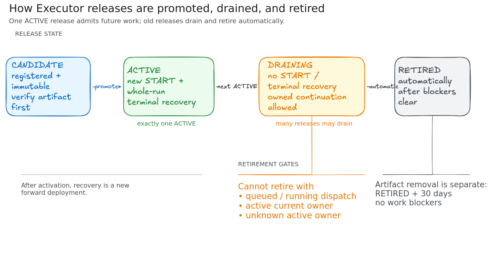
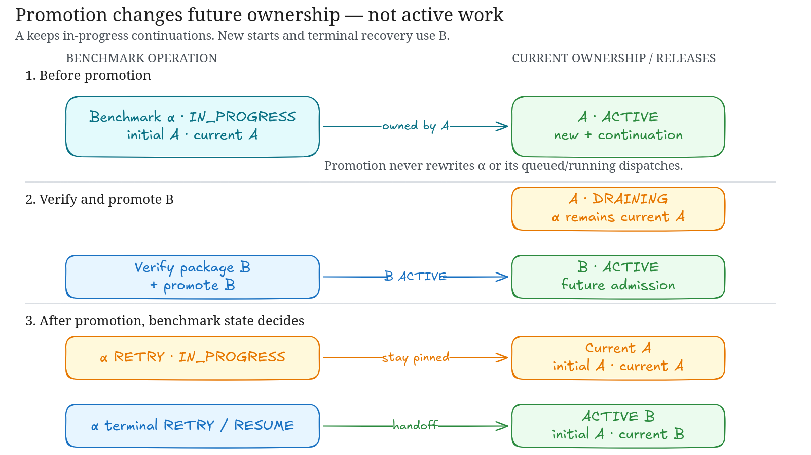
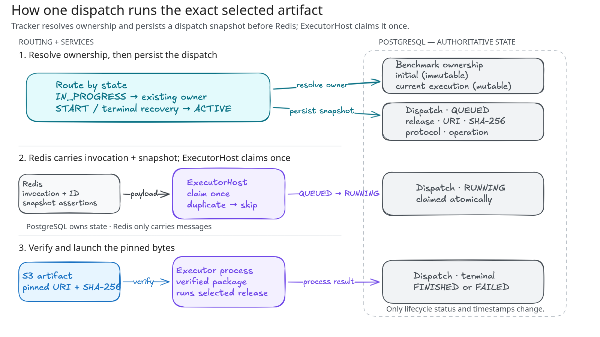

# Executor releases

Valkyrie keeps executor releases immutable. PostgreSQL owns the admission pointer,
each benchmark stores its initial release identity, and each executor dispatch
stores the release and artifact selected for that invocation.

## Lifecycle

1. Register a candidate with an `s3://` artifact, a SHA-256 digest, and protocol
   version `1`.
2. Verify readiness, then promote it. New benchmarks and whole-run terminal
   recovery select the `ACTIVE` release.
3. Benchmark admission stores immutable initial ownership and mutable current
   execution ownership before Tracker creates the immutable queued dispatch.
   ExecutorHost atomically claims that dispatch before launching the subprocess
   and marks it terminal after the subprocess exits.
4. The previous active release becomes `DRAINING`. It receives no new benchmark
   starts or terminal restarts, but active executions that it owns continue using
   it.
5. Whole-run terminal recovery moves current execution ownership to the then-
   `ACTIVE` release. In-progress retry never changes that ownership.
6. Retirement remains blocked by queued or running dispatches, active current
   owners, or any active benchmark whose current owner is unknown.
7. Tracker automatically retires each `DRAINING` release after all of those
   blockers clear. Retired releases cannot become active again.



## Execution-pinned recovery

Release routing changes only when an execution crosses a whole-run terminal
boundary. It does not change which tasks retry or resume selects.



| Operation and benchmark state | Executor release |
| --- | --- |
| New benchmark start | The `ACTIVE` release |
| Original work while `IN_PROGRESS` | The benchmark's current execution release |
| Retry dispatch while `IN_PROGRESS` | The current execution release, including when it is `DRAINING` |
| Resume while `IN_PROGRESS` | Existing behavior is unchanged; it does not hand off release ownership |
| Partial task stop while the benchmark remains `IN_PROGRESS` | No handoff; the benchmark keeps its current execution release |
| Retry or resume while `STOPPING` | Rejected, as today |
| Retry or resume from `STOPPED`, `FINISHED`, or `ERROR` | The `ACTIVE` release, which becomes the benchmark's current execution release |

A benchmark keeps two distinct ownership facts:

- **Initial release:** immutable provenance for the benchmark's first admission.
- **Current execution release:** the release used by continuation retries while
  the benchmark is active. A whole-run terminal retry or resume replaces this
  pointer with the then-`ACTIVE` release.

Every executor dispatch keeps its own immutable release and artifact snapshot.
A release becoming `DRAINING` never rewrites queued or running dispatches.



Start admission atomically persists benchmark ownership and its queued `START`
dispatch before enqueueing Redis. The transaction sets both immutable initial
ownership and current execution ownership to the locked `ACTIVE` release and
snapshots that release into the dispatch. If A becomes `DRAINING` after the
transaction commits, the admitted benchmark and dispatch remain on A and block
its retirement until their active work becomes terminal.

### Deployment during an active run

Given release A running a benchmark at 40/100 when B is promoted:

1. The 40 running tasks remain on A.
2. Tasks 41-100 from the existing execution also remain on A.
3. A mid-run retry remains on A.
4. A new benchmark start uses B.
5. Promotion alone never migrates tasks from A to B.

### Whole-run stop and recovery

A non-forced whole-run Stop moves `PENDING`, `BUILDING`, and `EVALUATING`
tasks to `STOPPED`. When it changes whole-run work, the benchmark enters
`STOPPING`; already `IN_PROGRESS` tasks and the current dispatch remain active
until normal finalization makes the run terminal. Resume then runs selected work
on the `ACTIVE` release and establishes that release as the new current
execution release.

A forced whole-run Stop also marks `IN_PROGRESS` tasks `STOPPED` and tears down
remaining sandboxes. Once no runnable work remains, it makes the benchmark
`STOPPED` and revokes active dispatches under the benchmark lock. A task-scoped
Stop preserves active dispatches while runnable work remains. If a forced
task-scoped Stop exhausts runnable work, it performs the same terminal transition
so an immediate Resume follows terminal recovery.

For example, after A reaches a whole-run terminal state and recovery starts on
B, later mid-run retries stay on B even if C has been promoted. A later
whole-run terminal retry or resume may then establish C as the current execution
release.

### Draining and retirement

A `DRAINING` release accepts no new benchmark starts or terminal restarts. It may
accept continuation retries for an `IN_PROGRESS` benchmark whose current
execution release is already that release.

Retirement remains blocked while a release owns an active execution or has a
queued or running dispatch. Tracker checks draining releases immediately at
startup and once per minute, then automatically retires every blocker-free
release. Once the execution and its dispatches are terminal, a later retry or
resume uses the `ACTIVE` release instead of retaining the retired release.

If the required current execution release or an `ACTIVE` release is unavailable,
recovery fails explicitly. It never silently switches releases.

### Non-goals

This release-affinity change does not alter:

- task selection for retry or resume;
- scoring, result history, or run IDs;
- partial-task stop behavior;
- concurrency limits or sandbox queue scheduling;
- task-level release assignment or automatic migration during promotion.

### Benchmark release provenance

Benchmark responses expose these release fields:

| Field | Meaning |
| --- | --- |
| `executor_release_id` | Immutable release selected when the benchmark was first admitted. |
| `current_execution_release_id` | Release currently owning execution. It changes only after a whole-run terminal retry or resume. |
| `executor_artifact_digest` | Immutable digest of the initial release artifact; it may differ from the artifact used after a terminal handoff. |
| `executor_protocol_version` | Immutable protocol version of the initial release. |

Pre-migration benchmarks can return null for these fields. The metadata endpoint
also exposes the initial `executor_artifact_uri`. The immutable per-dispatch
snapshot is authoritative for the exact artifact used by each invocation.

An `IN_PROGRESS` benchmark without a current execution release cannot continue.
Any `IN_PROGRESS` or `STOPPING` benchmark without one blocks all release
retirement. After it becomes terminal, retry or resume may establish the
`ACTIVE` release as its current owner.

### Failure and forward-recovery policy

An invalid or missing persisted owner for in-progress recovery is a `409`
conflict. Terminal recovery without a valid `ACTIVE` release is a `503` service
availability failure. After retrying a failed enqueue acknowledgement, Tracker
keeps a dispatch that was already claimed, rejects one superseded by newer work,
or marks a still-unclaimed dispatch `FAILED`. That failure errors only eligible
task attempts selected for that enqueue, errors the benchmark only when no active
sibling remains, and returns a `503` with the benchmark and dispatch IDs so Retry
can continue the run.

Tracker and ExecutorHost keep their normal ECS deployment circuit breakers, and
failed infrastructure updates retain normal CloudFormation rollback. Executor
activation runs only after that deployment succeeds. Once an executor release is
active, it is never rolled back or reactivated after draining; fix executor
failures by deploying a new release.

Migration `e9f0a1b2c3d4` is forward-only because dropping current ownership would
destroy required execution state. Normal rollback must never run `alembic
downgrade` across it. After this migration is applied, do not deploy a pre-
Package-R Tracker image: its migration history cannot resolve `e9f0a1b2c3d4` and
its runtime does not maintain current ownership. Fix Tracker failures forward;
database restoration is a separately approved disaster-recovery operation.

### First executor-dispatch cutover

The first deployment from the legacy three-field Taskiq message contract is a
manual outage. Perform these steps in order:

1. From the new release source, deploy the stage's `MonitoringStack` target with
   CDK `--exclusively` and verify that it no longer imports the legacy Worker
   service. Do not deploy `WorkerStack` or use all-stack scope in this step. This
   releases the cross-stack export before the later Worker deletion.
2. Force-stop any run that cannot drain normally.
3. Suspend Tracker scaling, set its desired count to zero, and verify that no
   Tracker task remains. This stops new legacy messages from being admitted.
4. Keep legacy Workers running until every benchmark is terminal and the Redis
   `taskiq` consumer group reports both zero pending messages and zero lag. Stream
   key existence alone is not proof that the queue drained.
5. Suspend legacy Worker scaling, set its desired count to zero, and verify that
   no Worker task remains.
6. With separate approval for this live AWS mutation, run `make deploy` with
   `SCOPE=executor` from the new source. The Python `ExecutorStack` updates the
   physical `WorkerStack` in place, deletes the drained legacy service, and
   retains `/valkyrie/worker` log history. This CDK-only bootstrap does not
   publish or activate an executor release.
7. Verify that `/valkyrie/<stage>/executor-release/launch-config` exists in SSM.
   Automated executor deployment fails closed until this parameter exists.
8. Rerun the branch deployment. It closes admission through the sealed control
   task, deploys the core migration, activates the immutable executor release,
   and restores Tracker only after successful completion. Do not deploy a pre-
   Package-R Tracker image after the migrations commit.

This procedure is operational only; the migrations contain no cutover state or
compatibility branch. It applies once, to the first executor-dispatch rollout.
The manual physical `WorkerStack` update is a separate protected action, not an
automatic bootstrap path.

## Automated deployment

Core and executor deployment use separate jobs and one non-cancelling deployment
mutex per stage. Every `dev` or `prod` push may deploy the Shared, Tracker, and
Monitoring stacks, but a core-only change never builds an executor artifact,
deploys the physical `WorkerStack`, activates a release, or enters executor
maintenance. Executor work runs only when the trusted classifier reports an
executor release, an `ExecutorStack` change, or an incompatible migration. After
acquiring the mutex, an executor job compares its SHA with the current branch
head and exits before AWS credentials or mutations when it is stale.

`ExecutorStack` is the Python owner and `executor` is the deployment scope. Its
physical CloudFormation identity remains `WorkerStack` to update the deployed
stack and retained resources in place.

An executor release builds one ARM64/Python 3.12 PEX from the exact Tracker source
and the dedicated `services/executor_artifact/uv.lock`. The release launcher uses
`infra/executor_release/uv.lock`; ordinary Tracker and CDK lock changes therefore
do not schedule executor work. The artifact digest is part of the release ID and
S3 key, so different bytes cannot reuse an existing release identity. The
executor lane uploads with create-only semantics, then runs one sealed
release-control task. Its `activate` transaction creates or matches the immutable
release, verifies the S3 digest, promotes it, and confirms it is the active
admission target before committing. PostgreSQL serializes overlapping activations
on the singleton admission row before either task creates or matches the release.

Dev executor operations follow a successful core deployment unless an incompatible
migration must run inside maintenance. Production executor operations use the
protected `prod` GitHub Environment directly on the mutating job, mirroring the
`dev` Environment wiring. The mutating executor job starts only after its
same-revision core dependency succeeds. The AWS accounts must already contain the
account-owned GitHub OIDC provider used by the environment-bound release roles.

The `maintenance-classification` job runs the same classifier used by deployment.
New tables, explicitly nullable default-free columns, changes that make an existing
column nullable, and explicitly non-unique indexes are safe. ExecutorStack and
release-control changes require executor maintenance. Other migration operations
require database maintenance. The required check deliberately fails for those
changes, so an authorized force merge is the maintenance approval.

For an approved maintenance deployment, the existing sealed release task closes
admission, marks active benchmarks and tasks `STOPPED`, fails queued or running
dispatches, removes ExecutorHost task protection, and sends `StopTask`. It does
not wait for provider cleanup before deployment. Tracker is stopped before the
stack update, and admission reopens only after every required stack update and
executor activation succeeds. A failure leaves the fence closed for a retry of
the same commit.

Automated executor deployment never skips maintenance. Before the one-time manual
cutover creates sealed control, the workflow fails because the stage launch-config
SSM parameter is absent and points operators to the cutover procedure above.
Later `ExecutorStack` changes use the normal maintenance flow. Manual workflow
dispatch remains limited to credential validation and planning; deployments come
from branch pushes.

Start, Retry, Resume, and concurrency changes return `503` while the fence is
held. Nothing is replayed automatically. Alembic startup upgrades use one
PostgreSQL advisory lock so rolling Tracker tasks cannot race migrations.
ExecutorHost runs one Taskiq worker process with up to 100 concurrent async tasks,
so its in-memory active count owns the whole ECS task. It renews a 120-minute ECS
protection lease every 30 minutes while work remains and cancels any in-flight
renewal before disabling protection.

Tracker retires blocker-free draining releases automatically; artifact deletion
remains separate.

## Lifecycle interfaces

There is no tenant release or maintenance HTTP endpoint and no manual release
lifecycle CLI. The sealed deployment task calls release and maintenance control
directly; GitHub can launch that task but cannot read database or tenant sandbox
credentials. New benchmark starts return `503` until executor activation commits
an `ACTIVE` admission target and any maintenance fence opens.

## Artifact retention

Retirement records a 30-day `artifact_retention_until` window. Artifact removal
is allowed only when the release is `RETIRED`, the window has expired, the
release has no active current owner or queued/running dispatch, and no
unattributed active benchmark exists. The current code exposes the deletion
guard; it does not run an automatic cleanup job.

An uncertain dispatch fails closed. A broker acknowledgement loss or ExecutorHost
crash can leave a nonterminal dispatch that blocks retirement until an operator
investigates it. A producer error does not prove that Redis rejected the append;
missing stream evidence does not prove non-delivery. Tracker returns and logs the
immutable dispatch ID for correlation.

Use this bounded investigation sequence:

1. Inspect the PostgreSQL dispatch row by immutable ID.
2. If it is `RUNNING` or terminal, do not replay it. A broker redelivery of that
   same ID cannot claim `RUNNING` again and the host skips executor side effects.
3. If it is `QUEUED`, inspect Redis stream/pending state and correlated logs only
   for evidence that append occurred. Absence is never proof of non-delivery.
4. Leave an unresolved row fail-closed. Replay or terminalization requires a
   separately approved and audited operator action that first resolves the
   execution outcome.

The retirement reconciler changes release metadata only. It does not schedule,
replay, requeue, repair, or delete executor work or artifacts.

Successive promotions are independent: A, B, and C may all drain concurrently,
and each retires automatically when its own active execution count reaches zero.
There is no two-release limit.

## Release-test

The release-test stage is dev-sized and targets the account selected by
`DEV_ACCOUNT_ID`; the target guard also permits an explicit production-account
campaign. Production-account validation uses `STAGE=release-test`, account
`613431292675`, and region `us-east-1`. Unrelated account resources remain outside
the release-test boundary.

Release-test also publishes `/valkyrie/release-test/executor-release/launch-config`
and the same sealed activation task used by deployment. It reuses the existing
release-test bucket and creates no GitHub OIDC release role; an explicitly
authorized release-test operator may use it for live deployment proof.

The Package R driver is a static Fargate task definition, not a service. It has a
no-ingress security group, explicit VPC/database/Redis/DNS/HTTPS egress, retained
logs, named secret references, and separate execution, task, and operator roles.
The operator role can run only that task definition and pass only its two roles.
Public IP assignment is a launch-time requirement because the stage has public
subnets and no NAT gateway; it does not expose Tracker, whose ALB remains
internal.

Before running the release-test driver, set:

```bash
export RELEASE_TEST_DRIVER_SECRET_ARN=arn:aws:secretsmanager:us-east-1:613431292675:secret:YOUR_DRIVER_SECRET-SUFFIX
export RELEASE_TEST_SANDBOX_PROVIDER_SECRET_ARN=arn:aws:secretsmanager:us-east-1:613431292675:secret:SANDBOX_PROVIDER_SECRET-SUFFIX
export RELEASE_TEST_OPERATOR_PRINCIPAL_ARN=arn:aws:iam::613431292675:role/ROLE_NAME
export RELEASE_TEST_IMAGE_TAG=package-r-RUN_ID
```

Package R staging is create-only. With credentials for the authorized operator
role, upload the executor artifact under its reserved prefix and require that the
key does not already exist:

```bash
export RELEASE_TEST_ARTIFACT_BUCKET=agentic-harness-release-test-613431292675
export PACKAGE_R_EXECUTOR_ARTIFACT=/path/to/executor.pex
aws s3api put-object \
  --bucket "$RELEASE_TEST_ARTIFACT_BUCKET" \
  --key "releases/package-r/$(basename "$PACKAGE_R_EXECUTOR_ARTIFACT")" \
  --body "$PACKAGE_R_EXECUTOR_ARTIFACT" \
  --if-none-match '*'
```

A repeated key fails rather than replacing immutable release bytes.

The principal must be an IAM role ARN, not an STS assumed-role session ARN. Both
secret references must be complete generated ARNs, including their suffixes; a
name or partial ARN is not valid. The sandbox-provider ARN identifies the secret
that the Driver task role may read. The driver secret must contain exactly
`tracker_api_key` and `benchmark_authorization`; ECS injects those values and the
database credentials from Secrets Manager. Never put secret values in task
command or environment overrides.

Release-test owns immutable `valkyrie/release-test/tracker` and
`valkyrie/release-test/executor-host` ECR repositories. This avoids mutating the
account-wide CDK bootstrap repository. Deploy Shared first when creating those
repositories, build and push both ARM64 images with the same new immutable tag,
then synthesize and deploy the dependent stacks with that tag. Dev and prod keep
the existing CDK asset path.

Review all stacks and the driver separately before deployment. Release-test
forces authentication on, so synthesis also needs the Descope project ID and
the account-local management-key secret name:

```bash
export DESCOPE_PROJECT_ID="release-test-descope-project-id"
export DESCOPE_MANAGEMENT_KEY_SECRET_NAME="release-test-descope-management-key-secret"

make plan STAGE=release-test SCOPE=all AWS_REGION=us-east-1 \
  DEV_ACCOUNT_ID=613431292675 PROFILE=admin
make plan STAGE=release-test SCOPE=driver AWS_REGION=us-east-1 \
  DEV_ACCOUNT_ID=613431292675 PROFILE=admin
```

The driver launch contract is published under
`/valkyrie/release-test/driver/`: task-definition ARN, security-group ID, log
group name, and operator-role ARN. Shared outputs already provide the cluster
and public subnet IDs. Launches must use those exact values,
`assignPublicIp=ENABLED`, and only reviewed non-secret command/manifest
overrides. Without one, the default command writes that requirement to stderr
and exits with status 64. Deploying the Driver stack publishes a new standalone
task-definition revision through the SSM launch-contract ARN; it does not restart
a task or service. Only future launches that resolve the new ARN receive the new
default.

The stage connects to `benchmarks.vals.ai`. Local clients outside the VPC cannot
call the internal Tracker directly; use the driver for HTTP and database proof.

After the one-time cutover, no legacy Worker or `taskiq` consumer is deployed.
Every message on `valkyrie-stable` must include an executor dispatch ID and
immutable artifact identity; ExecutorHost claims the matching PostgreSQL dispatch
before downloading or executing the artifact. Drain `taskiq` manually during the
cutover above; following deployments require no compatibility branch or
queue-drain sequence.
