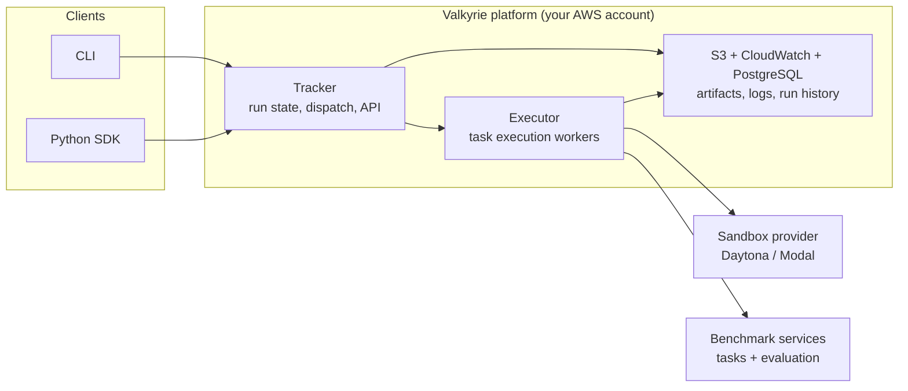

Valkyrie is a cloud service for building and running agentic benchmarks. It is the result of months of running evaluations at Vals AI and investigating where the common research workflows break down.

Evaluation used to happen on each researcher's own machine: one large instance, one local copy of the benchmark, results written to local disk. Every run competed with every other run for the same machine, every benchmark change had to be pulled and reconfigured by hand, and the record of what happened disappeared with the instance. Comparing two results meant trusting that they were produced under the same conditions.

At the volume we run benchmarks, that model stops working. We hit the niche cases first: a benchmark that needs a GPU, a task that needs a snapshot restored, an agent that needs network egress rules, a run that has to survive a worker restart. Existing harnesses could not absorb those cases at our scale, so we moved the whole process into the cloud as a service. Many researchers now create, host, and run benchmarks in parallel, and the results are durable, comparable, and owned by the organization rather than by whoever launched the run.

## The problems we hit

**Maintainer scalability.** When every benchmark lives in one repository, adding a benchmark means a pull request the core team has to review, and every user has to pull the change and reconfigure. Version mismatches between users are silent and hard to diagnose.

**Infrastructure scalability.** A single large instance has to be sized for peak load, sits idle between runs, and still caps parallelism far below what a benchmark with hundreds of tasks needs. Logs, results, and agent outputs live on that instance's disk, where they are easy to lose and hard to search.

**Submission verification.** When generation happens on the submitter's machine, a maintainer can re-score the outputs but cannot verify the conditions that produced them, such as per-task time limits, turn budgets, or network restrictions. Results are only comparable when those constraints are actually enforced.

**Agent integration.** Harnesses that require an agent to implement a class or function signature demand far more code than the job needs. The parts that genuinely differ between agents are the install command, the run command, where output lands, and which secrets and network access it requires.

## How Valkyrie solves it

Valkyrie separates the benchmark, the agent, and the infrastructure into independently deployed services.

<CardGroup cols={2}>
  <Card title="Benchmarks as services" icon="plug">
    Each benchmark is its own hosted service, owned by its author. A new benchmark is usable as soon as it is deployed, with no change to the core harness and no local copy to modify.
  </Card>
  <Card title="Declarative agents" icon="file-code">
    An agent is a contract: install command, run command, output location, secrets, and egress rules. The harness owns orchestration.
  </Card>
  <Card title="Horizontal execution" icon="layers">
    Tasks run in isolated sandboxes provisioned on demand, so parallelism is bounded by provider limits rather than by the size of one machine.
  </Card>
  <Card title="Your cloud, your record" icon="database">
    Runs, logs, and artifacts persist in your own AWS account, which gives a durable audit trail instead of a local directory.
  </Card>
</CardGroup>

Because generation happens inside infrastructure Valkyrie controls, per-task limits and network restrictions are enforced rather than trusted, and every run keeps the evidence of how it was produced.

## Architecture



| Subsystem | Responsibility |
| --- | --- |
| CLI and SDK | Start runs, upload agents, monitor progress, retrieve results |
| Tracker | Owns run state, dispatches tasks, exposes the API |
| Executor | Runs a task end to end: provision the sandbox, install and run the agent, collect outputs |
| Sandbox provider | Supplies the isolated environment each task executes in |
| Benchmark service | Serves task definitions and evaluates results for one benchmark |
| Storage | Persists artifacts, logs, and run history in your account |

For the deployed AWS topology, see [self-hosting infrastructure](/self-hosting/infrastructure).

## Paper

Valkyrie is described in [Valkyrie: A Microservice-Based Framework for Scalable Evaluation of AI Agents](https://doi.org/10.1145/3786335.3813231) (CAIS '26), which validates the system by running four agents across SWE-bench Verified and Terminal-Bench 2.0. A reading copy is on [alphaXiv](https://www.alphaxiv.org/abs/valkyrie).

```bibtex
@inproceedings{forzano2026valkyrie,
  author    = {Forzano, Jarett and Almatov, Omar and Nashold, Langston and Ravi, Nikil and Kassian, Orestes},
  title     = {Valkyrie: A Microservice-Based Framework for Scalable Evaluation of AI Agents},
  booktitle = {Proceedings of the 1st ACM Conference on Agentic and AI Systems},
  series    = {CAIS '26},
  year      = {2026},
  month     = {may},
  address   = {San Jose, CA, USA},
  publisher = {ACM},
  doi       = {10.1145/3786335.3813231},
  url       = {https://doi.org/10.1145/3786335.3813231}
}
```
